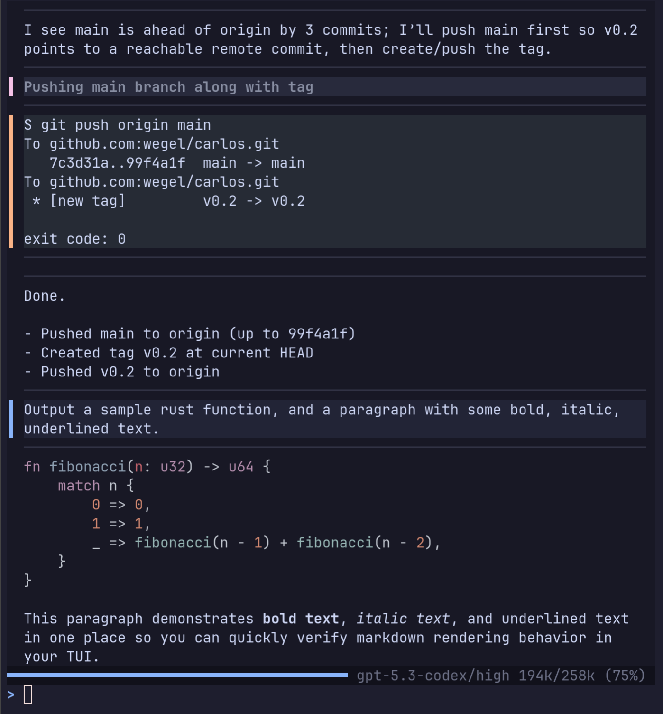

# carlos

Terminal frontend for `codex app-server`.

[](docs/screenshot.png)

## status

Alpha.

## features

- start a new codex thread with `carlos`
- resume with `carlos resume <SESSION_ID>` or pick from `carlos resume`
- runtime Ralph mode toggle (`Ctrl+R`) with:
  - prompt auto-injection from `.agents/ralph-prompt.md` (or `--ralph-prompt`)
  - blocked marker wait state (`@@BLOCKED@@` by default)
  - completion marker detection + auto-exit from Ralph mode (`@@COMPLETE@@` by default)
  - configurable markers (`--ralph-done-marker`, `--ralph-blocked-marker`)
- multiline input with `Shift+Enter` / `Alt+Enter`
- shell-like input history navigation with `Up/Down`
- rewind mode for prompt replay/edit (`Esc,Esc` on empty input)
- turn interrupt while agent is running (`Esc`)
- markdown rendering and code syntax highlighting
- diff rendering with hunk-oriented display
- compact tool/action rows (`Read`, `Search`, `Edit`, `Diff`, `run ...`)
- mouse scroll and drag selection with auto-copy on release
- OSC52 clipboard support for SSH sessions
- context usage indicator (`used/max (%)`) on the activity line
- Ralph mode visual indicators (`RALPH MODE` label, pink KITT/input gutter)
- context compaction markers in transcript

## Ralph Loop Setup

If you want to run a repository in Ralph mode, this repo includes a generic starter bundle in
[`examples/ralph-loop/`](examples/ralph-loop/). That directory is laid out to mirror the root of
the target repository, so you can copy its contents verbatim into another repo and start from
there.

Copy the bundle into the target repo root with:

```bash
cp -r examples/ralph-loop/. /path/to/target-repo/
```

The bundle contains only files that belong at the target repo root or under `.agents/`:

- an example [`AGENTS.md`](examples/ralph-loop/AGENTS.md)
- an example [`PROGRAM_PLAN.md`](examples/ralph-loop/PROGRAM_PLAN.md)
- ExecPlan guidance in [`PLANS.md`](examples/ralph-loop/.agents/PLANS.md)
- a seed ExecPlan in [`EXECPLAN_001_example.md`](examples/ralph-loop/.agents/execplans/EXECPLAN_001_example.md)
- the Ralph prompt in [`ralph-prompt.md`](examples/ralph-loop/.agents/ralph-prompt.md)
- the current reviewer prompt directory: [`reviewers/`](examples/ralph-loop/.agents/reviewers/) with [`engineering_reviewer.md`](examples/ralph-loop/.agents/reviewers/engineering_reviewer.md)
- an empty `.agents/done/` directory placeholder for completed ExecPlans

The intended flow is:

1. Copy the contents of `examples/ralph-loop/` into the repository you want to automate.
2. Replace the example ExecPlan with a real one and update `PROGRAM_PLAN.md`.
3. Start `carlos` and press `Ctrl+R`, or launch with:

```bash
carlos --ralph-prompt .agents/ralph-prompt.md
```

`carlos` handles the continuation loop inside the TUI, watches for `@@BLOCKED@@` and
`@@COMPLETE@@`, and lets you answer blockers directly in the session.

## build

```bash
cargo build --release
```

## run

```bash
cargo run
cargo run -- resume
cargo run -- resume <SESSION_ID>
cargo run -- --ralph-prompt .agents/ralph-prompt.md
```

## test

```bash
cargo test
```

## controls

- `Enter`: send message (or steer while a turn is active)
- `Shift+Enter` / `Alt+Enter`: newline in input
- `Up/Down`: input history navigation
- `Esc` (while turn active): interrupt running turn
- `Esc,Esc` (idle + input non-empty): clear input
- `Esc,Esc` (idle + input empty): enter rewind mode
- rewind mode `Up/Down`: select prior user prompts (also repositions transcript)
- rewind mode `Enter`: send selected/edited prompt
- rewind mode `Esc`: leave rewind mode and restore current draft
- `Ctrl+R`: toggle Ralph mode on/off (queued if a turn is currently active)
- `Ctrl+Y`: copy selection or last assistant message
- `Ctrl+L`: clear selection
- `PageUp/PageDown`: transcript scroll
- `Home/End`: jump top/bottom (empty input)
- `F6`: invert scroll direction
- `F8` or `Ctrl+P`: toggle perf overlay (or set `CARLOS_METRICS=1` at startup)
- mouse wheel: scroll
- left drag: select
- left release: copy selection
- `Ctrl+C`: quit

## notes

- SSH clipboard uses OSC52
- currently tested mainly on Linux terminals
- optional perf overlay/report: `CARLOS_METRICS=1`
